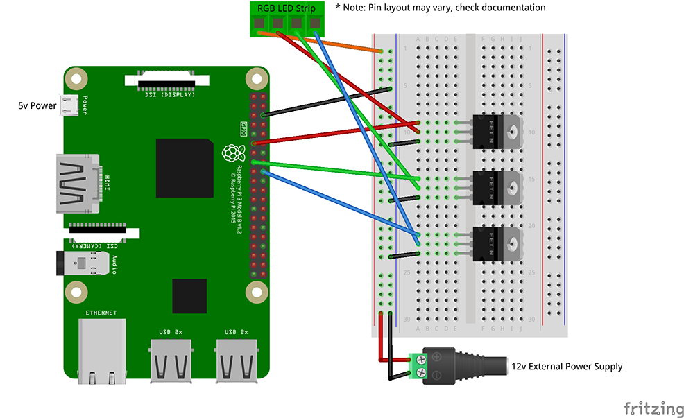

# Raspberry Pi - Homekit RGB LED Strip

## About
This repo pairs with my video on using the Raspberry Pi to control a 12v RGB LED strip with Homekit.

## YouTube Video for this Project
Coming soon ...

## Circuit Diagram


## Previous Video in This Series

[](https://www.youtube.com/watch?v=96uqxLQ_VFo)

## How to install

### &bull; BasementMaker Raspberry Pi Configurator (Recommended) > [GitHub Repo](https://github.com/basementmaker/raspberrypi-configurator)

```console
wget https://raw.githubusercontent.com/basementmaker/raspberrypi-configurator/master/pi-config.sh
chmod +x pi-config.sh
./pi-config.sh
```
or use the shorter URL version:
```console
wget https://basementmaker.net/pi-config.sh
chmod +x pi-config.sh
./pi-config.sh
```
then

Select: Video Projects  
then select: Raspberry Pi - HomeKit Controlled RGB LED Strip (Updated) [May 2020]

### &bull; Manually
- Install Node.js, version 12 preferred > [Instructions](https://github.com/nodesource/distributions/blob/master/README.md)
- Install PiGPIO > [Instructions](https://github.com/fivdi/pigpio)

and then these commands from the Raspberry Pi:
```console
git clone https://github.com/basementmaker/raspberrypi-homekit-rgb-led-strip.git
cd raspberrypi-homekit-rgb-led-strip
npm install
sudo npm start
```
